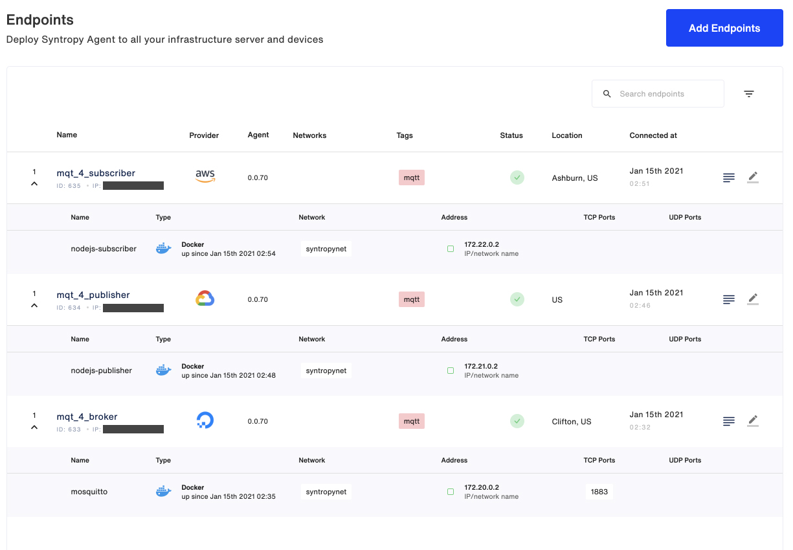
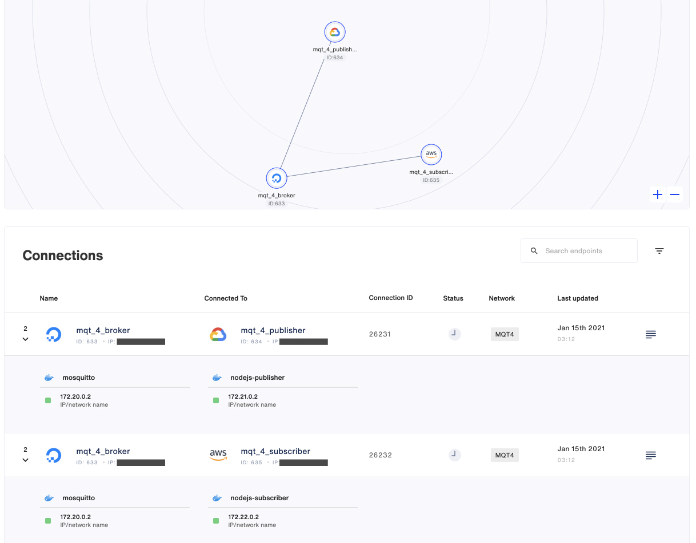

<p align="center">

</p>

This example describes how to use the **Syntropy Stack** with the Syntropy CLI to create an MQTT network with 3 nodes: A Broker, a Publisher and a Subscriber. It makes use of [Eclipse Mosquitto](https://mosquitto.org) as the MQTT Broker and the Publisher and Subscriber are simple NodeJS apps. The containers will be started using the Docker CLI. Each of the three nodes will run on a separate VM. The network and connections will be created using a YAML template and the SyntropyNAC (Network As Code) command line utility.

```
                     BROKER
                     ┌ ─ ─ ─ ─ ─ ─ ─ ─ ─ ─ ─ ─ ─ ┐

                     │     172.20.0.0            │
                          ┌────────────────┐
                     │    │    Moquitto    │     │
                          │  MQTT Broker   │
                     │    │                │     │
                          └────────────────┘
                     │    ┌────────────────┐     │
                          │                │
                     │    │ Syntropy Agent │     │
                          │                │
                     │    └────────────────┘     │

                     └ ─ ─ ─ ─ ─ ─ ─ ─ ─ ─ ─ ─ ─ ┘
                                ▲      │
                                │      │
                                │      │
                                │      │
                                │      │
               ┌────────────────┘      └──────────────────┐
               │                                          │
               │                                          │
 PUBLISHER     │                           SUBSCRIBER     ▼
  ┌ ─ ─ ─ ─ ─ ─ ─ ─ ─ ─ ─ ─ ─ ┐             ┌ ─ ─ ─ ─ ─ ─ ─ ─ ─ ─ ─ ─ ─ ┐

  │                           │             │                           │
       ┌────────────────┐                        ┌────────────────┐
  │    │    Syntropy    │     │             │    │    Syntropy    │     │
       │     Agent      │                        │     Agent      │
  │    └────────────────┘     │             │    └────────────────┘     │
       ┌────────────────┐                        ┌────────────────┐
  │    │     NodeJS     │     │             │    │     NodeJS     │     │
       │   Publisher    │                        │   Subscriber   │
  │    └────────────────┘     │             │    └────────────────┘     │

  │     172.21.0.0            │             │     172.22.0.0            │

  └ ─ ─ ─ ─ ─ ─ ─ ─ ─ ─ ─ ─ ─ ┘             └ ─ ─ ─ ─ ─ ─ ─ ─ ─ ─ ─ ─ ─ ┘
```

# Requirements

- **Syntropy Stack** account and an active Agent Token
- Three separate servers (preferrably running on separate cloud providers)
- Services must run inside docker containers (thus docker needs to be installed on each server)
- The subnets for the docker networks for each of the nodes must be unique
- Wireguard must be installed and running on each server
- No ports (including the MQTT `1883` and `9001`) on the VMs should be open and exposed to the internet.
- Python >= 3.6
- The SyntropyNAC (Network As Code) command line utility.

# Provision your VMs

You need to provision three separate VMs, preferrably on three separate cloud services. Depending on the cloud provider and distribution you select, you may need to install both `docker` and `wireguard` on each VM. For convenience, I've included an Ansible playbook that will take care of installing the required applications and dependencies.

Update the `syntropyhosts` file to include information for your hosts.

`ansible_ssh_private_key_file`: if any of your VMs require a `.pem` file for SSH access, include the file's location here.

`ansible_host`: VM's IP public IP address

`ansible_user`: Your host's SSH user

Ensure that you have access to your VMs via SSH and that they've been added to your list of authorized keys so that Ansible has access to the VMS.

Each VM requires Docker, Wireguard and Ansible python dependencies to be installed. This can be done using the `provision_hosts.yaml` playbook.

`ansible-playbook provision_hosts.yaml -i syntropyhosts -vv`

# Copy source files

Copy each of the service directories (broker|publisher|subscriber) to a different VM using `scp` or your favourite `sftp` client.

Eg.

```
scp -r /path/to/local/broker <user_name>@<remote_ip>:/broker
```

# Launch the Syntropy Agent on each VM

Perform these tasks on each VM. Remember to substitute the values between the `{ }` with your own. Reference to the docs for the Syntropy provider IDs can be found [here](https://docs.syntropystack.com/docs/syntropy-agent-variables).

Launch the syntropy agent.

```
sudo docker run --network="host" --restart=on-failure:10 --cap-add=NET_ADMIN --cap-add=SYS_MODULE \
-v /var/run/docker.sock:/var/run/docker.sock:ro \
--device /dev/net/tun:/dev/net/tun --name=syntropynet-agent \
-e SYNTROPY_API_KEY={your_api_key} \
-e SYNTROPY_TAGS=mqtt \
-e SYNTROPY_PROVIDER={your_vm_provider} \
-e SYNTROPY_AGENT_NAME={your_agent_name} \
-e SYNTROPY_NETWORK_API='docker' \
-d syntropynet/agent:stable
```

Create a docker network on each VM. Remember that your subnets cannot overlap, so make each one different. Eg.

```
172.20.0.0
172.21.0.0
172.22.0.0
```

Create a network on each VM using:

```
sudo docker network create --subnet {your_vm_subnet}/24 syntropynet
```

## Launch the Broker

SSH into your Broker VM and navigate to the `broker/` directory.

Start the docker container.

```
docker run -d --net="syntropynet" --name="mosquitto" -v $(pwd)/mosquitto.conf:/mosquitto/config/mosquitto.conf -v /mosquitto/data -v /mosquitto/log eclipse-mosquitto
```

Check that both processes are running using `sudo docker ps`. You should see both your containers online.

```
CONTAINER ID   IMAGE                      COMMAND                  CREATED        STATUS        PORTS      NAMES
af59c6413d44   eclipse-mosquitto          "/docker-entrypoint.…"   1 mins ago   Up 1 mins   1883/tcp   mosquitto
070feba189f3   syntropynet/agent:stable   "/usr/local/bin/synt…"   1 mins ago   Up 1 mins              syntropynet-agent
```

## Launch the Publisher

SSH into your Publisher VM and navigate to the `publisher/` directory. First, build the docker image.

`docker image build . -t node12`

Run the container using the image that was just built.

```
sudo docker run --detach --net="syntropynet" --name="nodejs-publisher" node12
```

Check that both processes are running using sudo docker ps. You should see both your containers online.

```
CONTAINER ID   IMAGE                      COMMAND                  CREATED         STATUS         PORTS     NAMES
9d628cf20945   node12                     "docker-entrypoint.s…"   9 seconds ago   Up 8 seconds             nodejs-publisher
c4daf1b7b572   syntropynet/agent:stable   "/usr/local/bin/synt…"   2 minutes ago   Up 2 minutes             syntropynet-agent
```

Now start watching the logs so we can watch for connections.

```
sudo docker logs --follow nodejs-publisher
```

You should see the following:

```
$ sudo docker logs --follow nodejs-publisher
Initializing Publisher
```

## Launch the Subscriber

SSH into your Subscriber VM and navigate to the `subscriber/` directory. First, build the docker image.

`docker image build . -t node12`

Run the container using the image that was just built.

```
sudo docker run --detach --net="syntropynet" --name="nodejs-subscriber" node12
```

Check that both processes are running using sudo docker ps. You should see both your containers online.

```
CONTAINER ID   IMAGE                      COMMAND                  CREATED         STATUS         PORTS     NAMES
10fb87cd638a   node12                     "docker-entrypoint.s…"   3 seconds ago   Up 2 seconds             nodejs-subscriber
2d275ce27431   syntropynet/agent:stable   "/usr/local/bin/synt…"   2 minutes ago   Up 2 minutes             syntropynet-agent
```

Watch the logs so we can watch for connections.

```
sudo docker logs --follow nodejs-subscriber
```

You should see the following:

```
$ sudo docker logs --follow nodejs-subscriber
Initializing Subscriber
```

# Confirm your endpoints are online

Open the Syntropy UI in your browser and confirm the endpoints are all online.



You can also confirm they're online using the Syntropy CLI. But before we can do that, we need to do install and configure the CLI.

# Install Syntropy CLI

Documentation can be found [here](https://docs.syntropystack.com/docs/syntropyctl).

Install the Syntropy CLI.

```
pip3 install syntropycli
```

Install Syntropy NAC.

```
pip3 install syntropynac
```

# Authentication

Next, we need to generate an API Token (not to be confused with your Agent Token). To generate an API Token, install the [Syntropy CLI](https://github.com/SyntropyNet/syntropy-cli).

Generate an API Token by logging in using the CLI:

```
syntropyctl login {syntropy stack user name} { syntropy stack password}
```

Copy the API token and add it to your ENV, for example via your `.bashrc` file. You'll need to add the API URL, as well as your username in password.

```
export SYNTROPY_API_SERVER=https://controller-prod-server.syntropystack.com
export SYNTROPY_API_TOKEN="your_syntropy_api_token"
export SYNTROPY_PASSWORD="your_syntropy_password"
export SYNTROPY_USERNAME="your_syntropy_username"
```

Now we're ready to use the CLI.

# Create your network

Check that your endpoints are available. SyntropyCTL (Computational Topology Library) is a command line utility that installed as part of the CLI.

```
syntropyctl get-endpoints
```

You should see your endpoints show up in a table like the one shown below.

```
+----------+------------------+----------------+-----------------------+----------+--------+------+
| Agent ID |       Name       |   Public IP    |        Provider       | Location | Online | Tags |
+----------+------------------+----------------+-----------------------+----------+--------+------+
|   555    | mqt_4_publisher  |    *.*.*.*     | Google Cloud Platform |          |  True  | mqtt |
|   556    | mqt_4_subscriber |    *.*.*.*     |  Amazon Web Services  | Ashburn  |  True  | mqtt |
|   557    |   mqt_4_broker   |    *.*.*.*     |      DigitalOcean     | Clifton  |  True  | mqtt |
+----------+------------------+----------------+-----------------------+----------+--------+------+
```

Next we'll use the Syntropy NAC (Network As Code) command line utility in conjunction with the network template defined in `networks/MQT4.yaml`. You can first perform a dry run using the `--dry-run` flag.

```
syntropynac configure-networks --dry-run networks/MQT4.yaml
```

Which outputs.

```
Configuring network MQT3
Would create network MQT3 as P2M
Would create 2 connections for network MQT3
Done
```

Next, create the network. The NAC utility will automatically enable your connection between services.

```
syntropynac configure-networks networks/MQT4.yaml
```

The result looks like:

```
$ syntropynac configure-networks networks/MQT4.yaml
Configuring network MQT4
Created network MQT4 with id 304
Created 2 connections for network MQT4
Configured 2 connections and 4 subnets for network MQT4
Done
```

You can view your newly created network in the Syntropy UI.



The final step is to check that your Publisher and Subscriber are sending and receiving data.

```
$ sudo docker logs --follow nodejs-publisher
Initializing Publisher
Established connection with Broker
[sending] January 15th 2021, 3:13:05 am
```

```
$ sudo docker logs --follow nodejs-subscriber
Initializing Subscriber
Established connection with Broker
[subscribed] topic: hello_syntropy
[subscribed] topic: init
[subscribed] topic: init
[received][hello_syntropy] Powered by SyntropyStack: January 15th 2021, 3:13:05 am
```

**Congratulations, your architecture is up and running ;-)**
