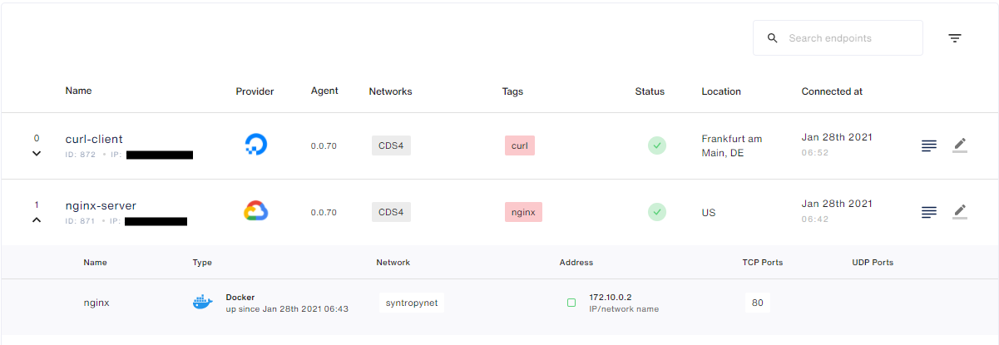
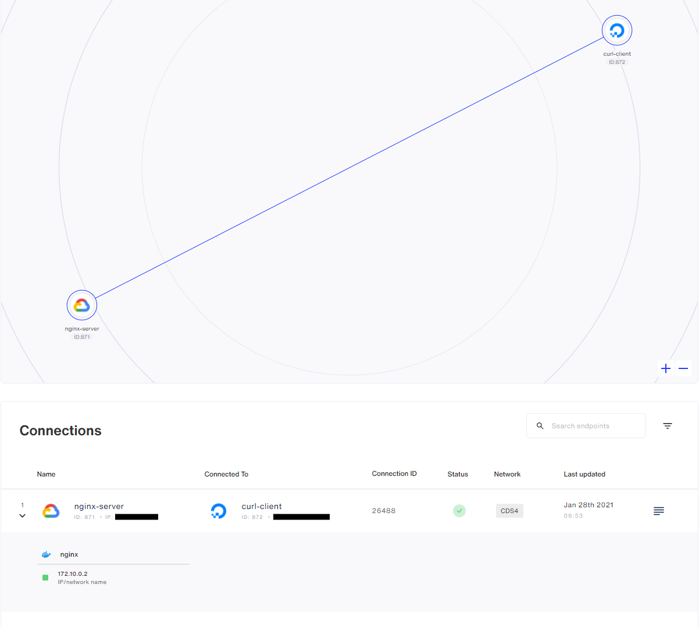

# Nginx + Curl + Syntropy CLI
This tutorial is going to demonstrate how to start a simple Syntropy network, consisting of a server running Nginx and a client using curl, with the help of Syntropy CLI.

## Requirements
- [Syntropy Stack](https://www.syntropystack.com/) account
- Two separate servers running on separate cloud providers
- Python >= 3.6
- Wireguard should be installed on both servers. Installation instructions can be found [here](https://www.wireguard.com/install/)
- Docker should be installed on both servers. Installation instructions can be found [here](https://docs.docker.com/get-docker/)


## VMs' configuration

### VM that will run Nginx
First, you will need to start a Syntropy Agent
```
sudo docker run --network="host" --restart=on-failure:10 --cap-add=NET_ADMIN --cap-add=SYS_MODULE \
-v /var/run/docker.sock:/var/run/docker.sock:ro \
--device /dev/net/tun:/dev/net/tun --name=syntropynet-agent \
-e SYNTROPY_API_KEY={agent-token} \
-e SYNTROPY_PROVIDER={vm-provider} \
-e SYNTROPY_AGENT_NAME=nginx-server \
-e SYNTROPY_NETWORK_API='docker' \
-e SYNTROPY_TAGS={tags} \
-d syntropynet/agent:latest
```
Providers' ids can be found [here](https://docs.syntropystack.com/docs/syntropy-agent-variables). Agent token can be generated [here](https://platform.syntropystack.com).

Next, you have to create a Docker network
```
sudo docker network create --subnet 172.10.0.0 syntropynet
```
and start Nginx container
```
sudo docker run -d --net=syntropynet --name nginx nginx
```

### Client's VM
For this VM, all you have to do is start a Syntropy Agent
```
sudo docker run --network="host" --restart=on-failure:10 --cap-add=NET_ADMIN --cap-add=SYS_MODULE \
-v /var/run/docker.sock:/var/run/docker.sock:ro \
--device /dev/net/tun:/dev/net/tun --name=syntropynet-agent \
-e SYNTROPY_API_KEY={agent-token} \
-e SYNTROPY_PROVIDER={vm-provider} \
-e SYNTROPY_AGENT_NAME=curl-client \
-e SYNTROPY_NETWORK_API='docker' \
-e SYNTROPY_TAGS={tags} \
-d syntropynet/agent:latest
```

### Confirm that endpoints are working
Navigate to Syntropy UI and you should see something similar to this:

## Network configuration
### Installation
To carry out the network configuration, you have to install Syntropy CLI
```
pip3 install syntropycli
```
and Syntropy NAC
```
pip3 install syntropynac
```
### Authentication
First of all, you have to add Syntropy API URL to your ENV
```
SYNTROPY_API_SERVER=https://controller-prod-server.syntropystack.com
```
then, you have to generate an API Token (not to be confused with the Agent Token)
```
syntropyctl login {syntropy-username} {syntropy-password}
```
and also add it to your ENV
```
SYNTORPY_API_TOKEN={api-token}
```
### Creating a network
To make sure that you are properly authenticated, run:
```
syntropyctl get-endpoints
```
and you should see all of your endpoints in a table like this:
```
+----------+--------------+----------------+-----------------------+-------------------+--------+-------+
| Agent ID |     Name     |   Public IP    |        Provider       |      Location     | Online |  Tags |
+----------+--------------+----------------+-----------------------+-------------------+--------+-------+
|   872    | curl-client  |     *.*.*.*    |      DigitalOcean     | Frankfurt am Main |  True  |  curl |
|   871    | nginx-server |     *.*.*.*    | Google Cloud Platform |                   |  True  | nginx |
+----------+--------------+----------------+-----------------------+-------------------+--------+-------+
```
Now, to create the network run:
```
syntropynac configure-networks network/CDS4.yaml
```
Which should output:
```
Configuring network CDS4
Created network CDS4 with id *
Created 1 connections for network CDS4
Configured 1 connections and 1 subnets for network CDS4
Done
```
In Syntropy UI, you should be able to see the network which should be similar to this:

Lastly, from the client's VM, execute
```
curl http://{nginx-docker-ip}
```
and you should receive a response:
```html
<!DOCTYPE html>
<html>
<head>
<title>Welcome to nginx!</title>
<style>
    body {
        width: 35em;
        margin: 0 auto;
        font-family: Tahoma, Verdana, Arial, sans-serif;
    }
</style>
</head>
<body>
<h1>Welcome to nginx!</h1>
<p>If you see this page, the nginx web server is successfully installed and
working. Further configuration is required.</p>

<p>For online documentation and support please refer to
<a href="http://nginx.org/">nginx.org</a>.<br/>
Commercial support is available at
<a href="http://nginx.com/">nginx.com</a>.</p>

<p><em>Thank you for using nginx.</em></p>
</body>
</html>
```
