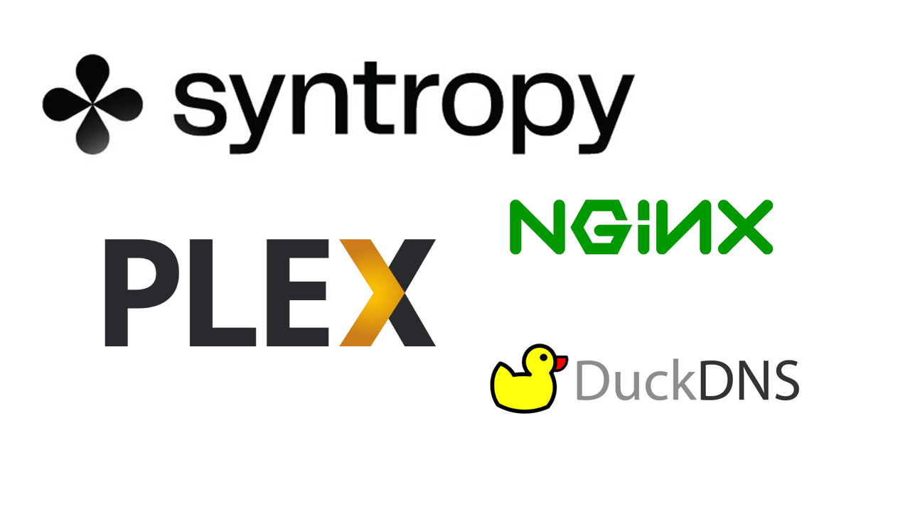
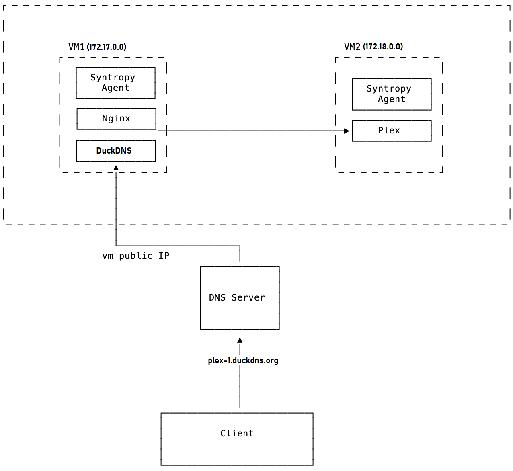
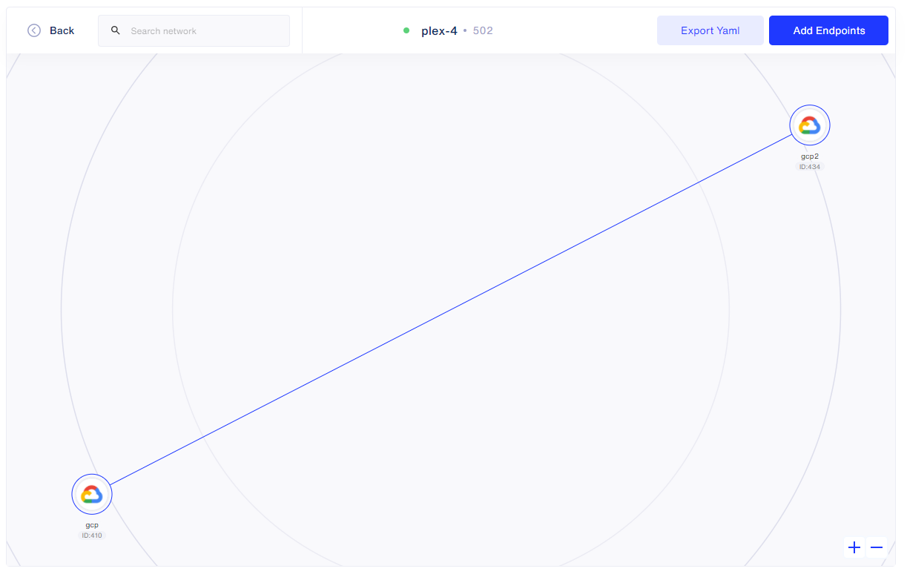
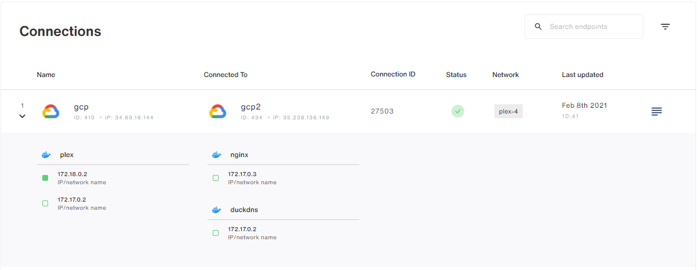
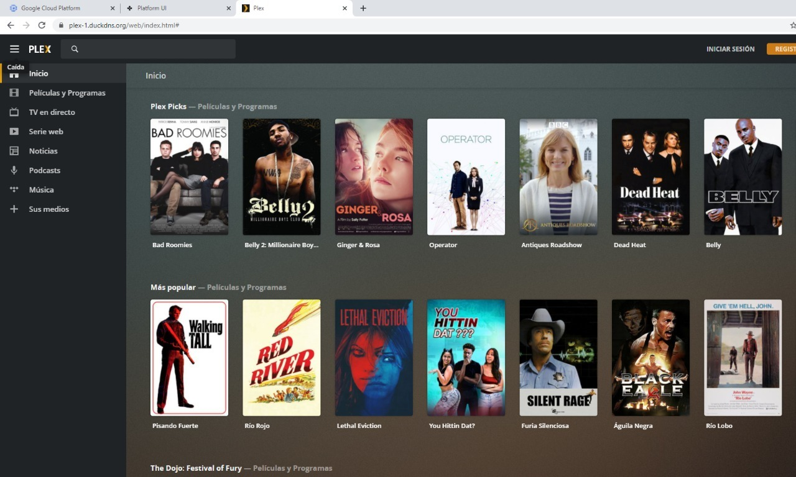

# Syntropy Network to connect to your home PLEX Server

## Objective

Connect to your home PLEX server behind NAT from the internet. 

Create a Syntropy Network with 2 nodes:

- One to run nginx service as a reversed proxy.
- One to run a Plex service.

## Requirements

* There must be no ports exposed to the internet (except Nginx 443 with SSL). You can't use -p flag.
* All services must run in Docker containers.
* All connections between services must be created using Syntropystack.
* After creating a connection, you must be able to connect to your Plex server service from your computer - https://plex.example.com
* You must create a Docker network (name: syntropynet) on each node and assign subnets, which can’t overlap.
* All services must run in syntropynet Docker network.
* For subdomain, you can use DuckDNS - https://hub.docker.com/r/linuxserver/duckdns

## Extra Conditions

* All containers started manually
* Connections created with SyntropyStack command-line tool (networks are defined in YAML files)

## Topology

To achieve the objective, this was the used topology:

## Considerations

- Both VM1 and VM2 were created using Google Cloud Platform.
- VM1 will be referred to as *gcp2* and VM2 will be referred to as *gcp* because those were the assigned names when they were created in Google Cloud Platform.

## Instructions

### 1. Access SyntropyStack Webpage and Create your Agent Token

The corresponding tab can be accessed from a buttom in the upper right part of the interface. Click on your e-mail and then click on Agent Tokens.

In the Agent Tokens tab, create a new Token with your desired expiration date. In this example, it was January 10th, 2021.

You will need that token for next steps.

### 2. Create your Google Cloud VMs

This step is necessary if you want to use a vps for the nodes like I did. But you could do this with any other types of nodes such as two computers (as long as they have different public IPs so they do not collide).

You will need to install wireguard as explained [here](https://www.wireguard.com/install/). As linux OS with a kernel newer than 5.6.0 has native support to wireguard I decided to create virtual machine instances with the newest Ubuntu version:

Once created, they should look like this:

As explained in [Considerations Section](#considerations), **gcp** will run the Plex server and **gcp2** will run nginx service.

### 3. Create an Account in duckdns and get your token

Go to https://duckdns.org, create an account and create a domain for your webpage (plex-1.duckdns.org in this case). Your dashboard should look like this:

You can then write the public ip of your VM1 and right after that whenever you try to access that URL, it will automatically redirect you to VM1's IP. If that public ip is dinamic, you can create a duckdns service to make it change automatically, which is explained in one of the next steps.

### 4. Get your certificates for your webpage

There are different ways to achieve this. I personally used certbot which has a well explained tutorial [here](https://certbot.eff.org/lets-encrypt/ubuntufocal-other). 

After finishing it, you should see a message like this:

You should also have 2 new files:
- privkey.pem
- fullchain.pem

### 4.1 Create a ssl_dhparam file

You can create it with openssl dhparam -out dhparam.pem 4096. Have in mind that is a process that can take several minutes.

### 5. Create an Internal Network for Plex

This step is necessary to avoid internal IP colissions between the docker processes. In VM2 run:

    docker network create --subnet=172.18.0.0/16 selnet

That will create a network called selnet with the ip 172.18.0.0. You could change both the name and ip if you want. 

By default, the network 172.17.0.0 was taken by docker so I added one number to it, to make it 172.18.0.0. But you could use other number if you want. To see what ips are used you can run:
    
    ip r

### 6 Configure Nginx password file

This step is optional. With this, you can set a password so only trusted people can access your plex server. In VM1 run:
    
    sudo htpasswd -c /your/selected/path/.htpasswd user1

where "user1" is the name of the user you want to give access to your plex server. After running it, you will be asked to write the password. You can re-run this command all the times you want (without the -c flag), to give access to more users.

### 6.1 Create your nginx configuration file

In VM1 create the nginx.conf file:

    sudo nano nginx.conf

And add the following lines:

    events {}

    http{
        ssl_session_cache shared:SSL:10m;
        ssl_session_timeout 10m;

        upstream plex_backend {
            server plex-docker-ip:32400;
            keepalive 32;
        }
        server {
            listen 80;
            listen 443 ssl;
            listen [::]:443 ssl ipv6only=on; 
            server_name duckdns-url;

            ssl_certificate path/to/fullchain.pem;
            ssl_certificate_key path/to/privkey.pem;
            ssl_dhparam path/to/dhparam.pem;
            ssl_ecdh_curve secp384r1;

            proxy_set_header Host $host;
            proxy_set_header X-Real-IP $remote_addr;

            location / {
                proxy_pass http://plex_backend;
                auth_basic "Administrator’s Area";
                auth_basic_user_file path/to/.htpasswd;
            }
        }
    }

With that, nginx will be configured to redirect the access from VM1 to VM2. Parameters Explanation:
* **plex-docker-ip**: This is the ip of the docker service (in this case 172.18.0.2. It could be different so always run "ip r" to check it).
* **duckdns-url**: The URL you choose from duckdns.org, in this case: plex-1.duckdns.org.
* **auth_basic**: This is the title you will see when you access your webpage and will be asked for the user name and password that you defined in the previous step.
* **auth_basic_user_file**: The path to the .htpasswd file that you created in the previous step.

If you want, you can add more lines to the configuration file to make it more optimized to use it with plex. Check the nginx.conf file uploaded in this folder to see all the configuration parameters that I used. But these ones, are the most important ones.

### 7. Log into each node and run all the services

Connect to the VMs using SSH. The easiest way is to click on the SSH button and go to "Open in browser window". That will open a new window which will connect to the VM usingg SSH. Another way is to use gcloud commands. You can get the specific commands by clicking on the SSH menu, on each instance.

For instance, this is the command to SSH to **gcp** node:

### 7.1 Install Docker

You need to [install docker](https://docs.docker.com/engine/install/ubuntu/) first on each VM.

### 7.2 For VM1:

Run Nginx Service:

    sudo docker run --detach \
    --name nginx \
    --publish 443:443 \
    --volume /etc/nginx/certs \
    --volume /etc/nginx/vhost.d \
    --volume /usr/share/nginx/html \
    --volume /var/run/docker.sock:/tmp/docker.sock:ro \
    --volume /./auth:/etc/nginx/htpasswd \
    --volume /etc/letsencrypt:/etc/letsencrypt/ \
    --network="host"\
    --volume path/to/nginx.conf:/etc/nginx/nginx.conf jwilder/nginx-proxy 

Run Syntropy Service:

    sudo docker run --network="host" --restart=on-failure:10 \
    --cap-add=NET_ADMIN \
    --cap-add=SYS_MODULE -v /var/run/docker.sock:/var/run/docker.sock:ro \
    --device /dev/net/tun:/dev/net/tun --name=syntropy \
    -e SYNTROPY_NETWORK_API='docker' \
    -e SYNTROPY_API_KEY=AGENT_TOKEN -d syntropynet/agent:stable

Run DuckDNS Service:

    sudo docker run -d \
    --name=duckdns \
    -e PUID=1000 \
    -e PGID=1000 \
    -e TZ=us-central1-a \
    -e SUBDOMAINS=plex-1 \
    -e TOKEN=DUCK_DNS_TOKEN \
    --restart unless-stopped \
    linuxserver/duckdns

Remember to replace **AGENT_TOKEN** by the Agent Token that you generated on the UI of SyntropyStack. Also **DUCK_DNS_TOKEN** is the token you copy from duckdns.org.

### 7.3 For VM2:

Run Plex Service with:

    sudo docker run --detach \
    --name=plex \
    --net=selnet \
    -e PUID=1000 \
    -e PGID=1000 \
    -e VERSION=docker \
    -e UMASK_SET=022 `#optional` \
    -v /share/container/plex/config:/config \
    -v /share/container/plex/TV:/tv \
    -v /share/container/plex/Movies:/movies `#optional, you can alter them if you already stored you media files elsewhere, you can also add as many shares as you like` \
    --restart unless-stopped \
    linuxserver/plex:latest

Notice that I'm running plex in network **selnet** which is the one I created in a previous step.

Run the Syntropy Service:

    sudo docker run --network="host" --restart=on-failure:10 \
    --cap-add=NET_ADMIN \
    --cap-add=SYS_MODULE -v /var/run/docker.sock:/var/run/docker.sock:ro \
    --device /dev/net/tun:/dev/net/tun --name=syntropy \
    -e SYNTROPY_NETWORK_API='docker' \
    -e SYNTROPY_API_KEY=AGENT_TOKEN -d syntropynet/agent:stable

Remember to replace **AGENT_TOKEN** by the Agent Token that you generated on the UI of SyntropyStack. 

Notice that the command to run the Syntropy Service is the same in both VM1 and VM2.

### 8. Create the Syntropy Network

### 8.1 Authentication

First of all, you have to add Syntropy API URL to your ENV

    SYNTROPY_API_SERVER=https://controller-prod-server.syntropystack.com

then, you have to generate an API Token (not to be confused with the Agent Token):

    syntropyctl login {syntropy-username} {syntropy-password}

and also add it to your ENV

    SYNTORPY_API_TOKEN={api-token}

### 8.2 Network Creation

To make sure that you are properly authenticated, run:

    syntropyctl get-endpoints

and you should see all of your endpoints in a table like this:

    +----------+--------------------+-----------------+-----------------------+--------------+--------+------+
    | Agent ID |        Name        |    Public IP    |        Provider       |   Location   | Online | Tags |
    +----------+--------------------+-----------------+-----------------------+--------------+--------+------+
    |   434    |        gcp2        |  35.238.136.149 | Google Cloud Platform |              |  True  |  -   |
    |   410    |        gcp         |   34.69.16.144  | Google Cloud Platform |              |  True  |  -   |
    +----------+--------------+----------------+-----------------------+-------------------+--------+--------+

Now, to create the network run:

    syntropynac configure-networks {config_file.yaml}

where {config_file.yaml} is the file that defines the network. This is the structure that you must use:

    name: name-of-network
    state: present
    topology: p2m
    connections:
        VM1-hostname:
            type: endpoint
            connect_to:
                VM2-hostname:
                    type: endpoint
                    services:
                        - plex

Or you can use the file network/plex.yaml included with this repo.

In Syntropy UI, you should be able to see the network which should be similar to this:

### 9. Access Plex from VM1

With all the previous steps completed, you should be able to access your plex server from your VM1.

You can run this command to save the plex webpage.

    wget https://plex-1.duckdns.org/web

Or you can directly access the plex webapp with the web explorer going to

    https://plex-1.duckdns.org

The first time you access, you will be asked for a username and password if you defined it in step 6:

And that is it! You have your plex service up and running.

As you can see, it shows as a verified webpage and you are accessing using port 443 (not any internal ip).

**Congratulations, your architecture is up and running.**
